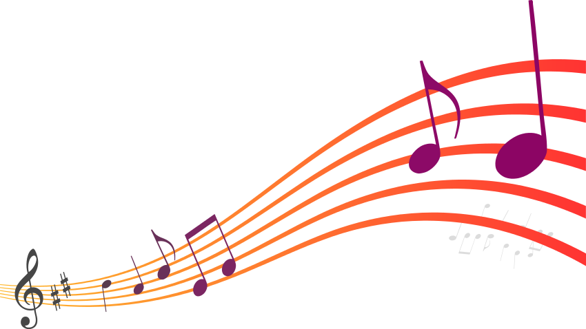
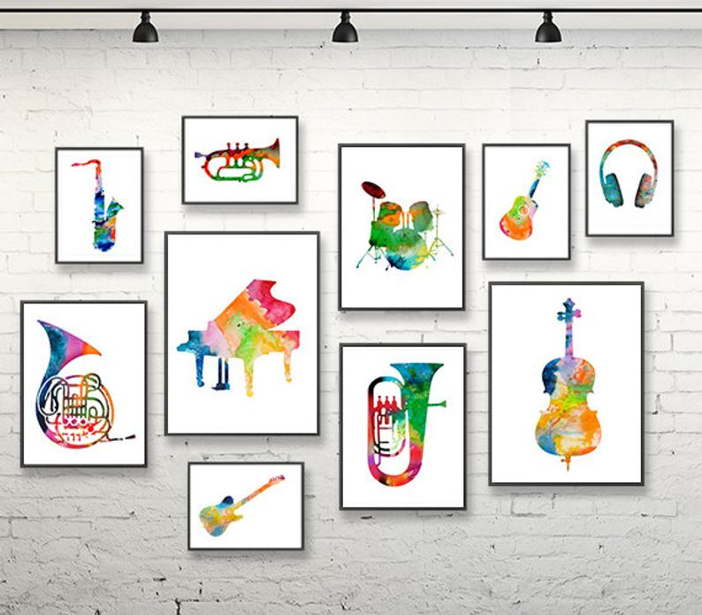

This is the version of R that I am using in case anyone wants to replicate my code, and wants to get the exact same results that I get.
```{r}
print(R.version)
```


The data was first pre-processed using the Text_processing.Rmd file which is in the doc folder. After pre-processing I processed the text by seperating the pre-processed data in to categories, mostly by different decades and different genres.


Also package pacman was installed to install and import the rest of the packages.





```{r,warning=FALSE, message=FALSE,echo=FALSE}
library(pacman)
pacman::p_load( dplyr, GGally, ggplot2, ggthemes, ggvis, httr, lubridate, plotly, rio, rmarkdown, shiny, stringr, tidyr, tidytext, gridExtra, wordcloud, scales,knitr)

```


```{r, warning=FALSE, message=FALSE,echo=FALSE}
knitr::opts_chunk$set(echo = TRUE)
```

```{r,warning=FALSE, message=FALSE,echo=FALSE}
load('../output/processed_lyrics.RData')
```

```{r,warning=FALSE, message=FALSE,echo=FALSE}
tidy_lyrics <- dt_lyrics %>%
  unnest_tokens(word,stemmedwords)
tidy_lyrics_count <- tidy_lyrics %>%
  count(word, sort = TRUE)
```


```{r,warning=FALSE, message=FALSE,echo=FALSE}
# Break up the main dataframe into multiple dataframs spilt by decades and genre. Each graph is then counted, as well as adding a perecentage column giving each words its relative percentage out of all the words ong the graph.

tidy_lyrics_60s <- tidy_lyrics[tidy_lyrics$year>1959 & tidy_lyrics$year<1970,]
tidy_lyrics_70s <- tidy_lyrics[tidy_lyrics$year>1969 & tidy_lyrics$year<1980,]
tidy_lyrics_80s <- tidy_lyrics[tidy_lyrics$year>1979 & tidy_lyrics$year>1990,] 
tidy_lyrics_90s <- tidy_lyrics[tidy_lyrics$year>1989 & tidy_lyrics$year<2000,]
tidy_lyrics_00s <- tidy_lyrics[tidy_lyrics$year>1999 & tidy_lyrics$year<2010,] 
tidy_lyrics_10s <- tidy_lyrics[tidy_lyrics$year>2009 & tidy_lyrics$year<2020,]

tidy_lyrics_hiphop <- tidy_lyrics[tidy_lyrics$genre == "Hip-Hop", ] 
tidy_lyrics_other  <- tidy_lyrics[tidy_lyrics$genre == "Other", ]  
tidy_lyrics_pop <- tidy_lyrics[tidy_lyrics$genre == "Pop", ]  
tidy_lyrics_metal <- tidy_lyrics[tidy_lyrics$genre == "Metal", ] 
tidy_lyrics_rock <- tidy_lyrics[tidy_lyrics$genre == "Rock", ]  
tidy_lyrics_country <- tidy_lyrics[tidy_lyrics$genre == "Country", ] 
tidy_lyrics_indie <- tidy_lyrics[tidy_lyrics$genre == "Indie", ]  
tidy_lyrics_jazz <- tidy_lyrics[tidy_lyrics$genre == "Jazz", ] 
tidy_lyrics_na <- tidy_lyrics[tidy_lyrics$genre == "Not Available",] 
tidy_lyrics_electric <- tidy_lyrics[tidy_lyrics$genre == "Electronic", ]
tidy_lyrics_rb <- tidy_lyrics[tidy_lyrics$genre == "R&B", ] 
tidy_lyrics_folk <- tidy_lyrics[tidy_lyrics$genre == "Folk", ]

tidy_lyrics_60s_count <- tidy_lyrics_60s %>% count(word, sort= TRUE) %>%  mutate(percentage = n / sum(n) * 100) 
tidy_lyrics_70s_count <- tidy_lyrics_70s %>% count(word, sort= TRUE) %>%  mutate(percentage = n / sum(n) * 100)
tidy_lyrics_80s_count <- tidy_lyrics_80s %>% count(word, sort= TRUE) %>%  mutate(percentage = n / sum(n) * 100)
tidy_lyrics_90s_count <- tidy_lyrics_90s %>% count(word, sort= TRUE) %>%  mutate(percentage = n / sum(n) * 100)
tidy_lyrics_00s_count <- tidy_lyrics_00s %>% count(word, sort= TRUE) %>%  mutate(percentage = n / sum(n) * 100)
tidy_lyrics_10s_count <- tidy_lyrics_10s %>% count(word, sort= TRUE) %>%  mutate(percentage = n / sum(n) * 100)
tidy_lyrics_hiphop_count <- tidy_lyrics_hiphop %>% count(word, sort= TRUE) %>%  mutate(percentage = n / sum(n) * 100)
tidy_lyrics_other_count <- tidy_lyrics_other %>% count(word, sort= TRUE) %>%  mutate(percentage = n / sum(n) * 100)
tidy_lyrics_pop_count <- tidy_lyrics_pop %>% count(word, sort= TRUE) %>%  mutate(percentage = n / sum(n) * 100)
tidy_lyrics_metal_count <- tidy_lyrics_metal %>% count(word, sort= TRUE) %>%  mutate(percentage = n / sum(n) * 100)
tidy_lyrics_rock_count <- tidy_lyrics_rock %>% count(word, sort= TRUE) %>%  mutate(percentage = n / sum(n) * 100)
tidy_lyrics_country_count <- tidy_lyrics_country %>% count(word, sort= TRUE) %>%  mutate(percentage = n / sum(n) * 100)
tidy_lyrics_indie_count <- tidy_lyrics_indie %>% count(word, sort= TRUE) %>%  mutate(percentage = n / sum(n) * 100)
tidy_lyrics_jazz_count <- tidy_lyrics_jazz %>% count(word, sort= TRUE) %>%  mutate(percentage = n / sum(n) * 100)
tidy_lyrics_na_count <- tidy_lyrics_na %>% count(word, sort= TRUE) %>%  mutate(percentage = n / sum(n) * 100)
tidy_lyrics_electric_count <- tidy_lyrics_electric %>% count(word, sort= TRUE) %>%  mutate(percentage = n / sum(n) * 100)
tidy_lyrics_rb_count <- tidy_lyrics_rb %>% count(word, sort= TRUE) %>%  mutate(percentage = n / sum(n) * 100)
tidy_lyrics_folk_count <- tidy_lyrics_folk %>% count(word, sort= TRUE) %>%  mutate(percentage = n / sum(n) * 100)
```

&nbsp;  ;

Music is part of almost everyone’s everyday life. Everyone has a song they like, a genre they prefer, and a decade of music they like the most. But, people get so opinionated about the music that they listen to, so much so that there is even a common motif in entertainment how older adults comment about how songs today are not as good as the songs they grew up listening to. As someone who grew up, almost exclusively, listening to my parents favorite music (music from the 1960s and the 1970s), I would generally agree with that motif as well, although my opinion on that seems to be changing. However, my general reasoning for why I prefer older songs is because I think older songs from the 1960s and 70s tend to be less repetitive (at least lyrically) than the songs from the 2000s and 2010s. So my first question is:

## Are the songs from the 60s and 70s more repetitive than songs from the 2000s and 2010s? 

I’m going to show this by first finding and comparing the frequency of the top 20 words from the 1960s and 1970s to the top 20 words from the 2000s and 2010s and see how much more the frequency (percentages) from the top 20 most frequent words compare to each other going down. 


```{r,warning=FALSE, message=FALSE,echo=FALSE}
# Joined the 60s and 70s dataframes and the 2000s and 2010s dataframe and made a jitter scatter plot comparing the frequencies (percentages) of the words used in each pair of decades.
# Code to make this graph was used from http://tzstatsads.github.io/tutorials/proj1_jiaqianyu.html


freq60s_70s <- bind_rows(tidy_lyrics_60s,
                         tidy_lyrics_70s)

freq00s_10s <- bind_rows(tidy_lyrics_00s,
                         tidy_lyrics_10s)


frequency <- bind_rows(mutate(freq60s_70s, decade = "The60sand70s"),
                       mutate(freq00s_10s, decade = "The00sand10s")) %>% 
  count(decade, word, sort = TRUE) %>%
  group_by(decade) %>%
  mutate(percentage = n / sum(n) * 100) %>% 
  select(-n) %>% 
  spread(decade, percentage) 

frequency <- na.omit(frequency)

ggplot(frequency, 
             aes_string(x = colnames(frequency)[2], y = colnames(frequency)[3] ),
             color = "red") +
      geom_abline(color = "gray40", lty = 2) +
      geom_jitter (alpha = 0.1, size = 1, width = 0.3, height = 0.3, aes(color= frequency$The60sand70s-frequency$The00sand10s)) + 
       scale_colour_gradientn(colours = rainbow(10))+
  labs(title="60s and 70s vs. 00s and 10s Word Frequence")+
      geom_text(aes(label = word), check_overlap = TRUE, vjust = 1.5) +
      scale_x_log10(labels = percent_format()) +
      scale_y_log10(labels = percent_format()) +
      theme(legend.position="none")
```


```{r,warning=FALSE, message=FALSE,echo=FALSE}
#Graph 2 graphs of the 60s and 70s pair and the 2000s and 2010s pair top 10 words

bins =20
graph_60s_70s <- freq60s_70s %>% 
  count(word, sort= TRUE) %>%  
  mutate(percentage = n / sum(n) * 100)%>%
  filter(row_number() <= bins) %>%
  mutate(word = reorder(word, percentage)) %>%
  ggplot(aes(word, percentage ))+
  labs(title="1960s and 1970s Top 20 Word's Percentages") +
  geom_col(fill = rainbow(bins)) +
  xlab(NULL)

graph_00s_10s <- freq00s_10s %>%
  count(word, sort= TRUE) %>% 
  mutate(percentage = n / sum(n) * 100) %>%
  filter(row_number() <= bins) %>%
  mutate(word = reorder(word, percentage)) %>%
  ggplot(aes(word, percentage)) +
  labs(title="2000s and 2010s Top 20 Word's Percentages") +
  geom_col(fill = rainbow(bins)) +
  xlab(NULL) 
grid.arrange(graph_60s_70s, graph_00s_10s)

```


You can tell from the two plots it seems that the frequency of each topic (words) from these decades are relatively similar. The big difference is that the most frequent word from the 1960s and 1970s appears 3% of the time, while the most frequent word from the 2000s and 2010s appears about 2% of the time. So it seems that songs from the past seem to be more repetitive than songs from today. However, to get a more clear picture if songs are becoming more repetitive, lets compare the frequency graphs of each decade and see the percentage of their top 10 most frequently used words and see how much the frequency changes as the decades change.


```{r,warning=FALSE, message=FALSE,echo=FALSE}
# Graph pie charts of each of the decades comparing the top 10 words percentages vs the rest of the words percentages

# using code structure from https://www.statmethods.net/graphs/pie.html to help make pie charts

top_words= 10

par(mfrow=c(3,2))

first_slice_60s <- tidy_lyrics_60s_count %>% filter(row_number()< top_words)
second_slice_60s <- tidy_lyrics_60s_count %>% filter(row_number()>=top_words)
slices <- c(sum(first_slice_60s$percentage), sum(second_slice_60s$percentage))
lbls <- c("Top 10 words", "The rest")
pct <- round(slices/sum(slices)*100)
lbls <- paste(lbls, pct) # add percents to labels
lbls <- paste(lbls,"%",sep="") # ad % to labels
pie(slices,labels = lbls, col=rainbow(length(lbls)),
   main="Top 10 Words from 1960s percentages")

first_slice_70s <- tidy_lyrics_70s_count %>% filter(row_number()<top_words)
second_slice_70s <- tidy_lyrics_70s_count %>% filter(row_number()>=top_words)
slices <- c(sum(first_slice_70s$percentage), sum(second_slice_70s$percentage))
lbls <- c("Top 10 words", "The rest")
pct <- round(slices/sum(slices)*100)
lbls <- paste(lbls, pct) # add percents to labels
lbls <- paste(lbls,"%",sep="") # ad % to labels
pie(slices,labels = lbls, col=rainbow(length(lbls)),
   main="Top 10 Words from 1970s percentages")

first_slice_80s <- tidy_lyrics_80s_count %>% filter(row_number()<top_words)
second_slice_80s <- tidy_lyrics_80s_count %>% filter(row_number()>=top_words)
slices <- c(sum(first_slice_80s$percentage), sum(second_slice_80s$percentage))
lbls <- c("Top 10 words", "The rest")
pct <- round(slices/sum(slices)*100)
lbls <- paste(lbls, pct) # add percents to labels
lbls <- paste(lbls,"%",sep="") # ad % to labels
pie(slices,labels = lbls, col=rainbow(length(lbls)),
   main="Top 10 Words from 1980s percentages")


first_slice_90s <- tidy_lyrics_90s_count %>% filter(row_number()<top_words)
second_slice_90s <- tidy_lyrics_90s_count %>% filter(row_number()>=top_words)
slices <- c(sum(first_slice_90s$percentage), sum(second_slice_90s$percentage))
lbls <- c("Top 10 words", "The rest")
pct <- round(slices/sum(slices)*100)
lbls <- paste(lbls, pct) # add percents to labels
lbls <- paste(lbls,"%",sep="") # ad % to labels
pie(slices,labels = lbls, col=rainbow(length(lbls)),
   main="Top 10 Words from 1990s percentages")


first_slice_00s <- tidy_lyrics_00s_count %>% filter(row_number()<top_words)
second_slice_00s <- tidy_lyrics_00s_count %>% filter(row_number()>=top_words)
slices <- c(sum(first_slice_00s$percentage), sum(second_slice_00s$percentage))
lbls <- c("Top 10 words", "The rest")
pct <- round(slices/sum(slices)*100)
lbls <- paste(lbls, pct) # add percents to labels
lbls <- paste(lbls,"%",sep="") # ad % to labels
pie(slices,labels = lbls, col=rainbow(length(lbls)),
   main="Top 10 Words from 2000s percentages")

first_slice_10s <- tidy_lyrics_10s_count %>% filter(row_number()<top_words)
second_slice_10s <- tidy_lyrics_10s_count %>% filter(row_number()>=top_words)
slices <- c(sum(first_slice_10s$percentage), sum(second_slice_10s$percentage))
lbls <- c("Top 10 words", "The rest")
pct <- round(slices/sum(slices)*100)
lbls <- paste(lbls, pct) # add percents to labels
lbls <- paste(lbls,"%",sep="") # ad % to labels
pie(slices,labels = lbls, col=rainbow(length(lbls)),
   main="Top 10 Words from 2010s percentages")


```


Note that the 1960s date seems to be skewed, and after some investigation I found that the dataset for the 1960s only has 40 songs while the rest of the decade have at least 10,000 songs. 

Decade by decade you can see that the most frequently used words seem to be pretty consistent, where the most used words appear about 9% of the time per decade. If any change is happening it seems that the 1970s is the most repetitive decade, where the top 10 most frequent words appear 10% of the time. The next decades drops to using its top 10 most frequent word only 8% of the time or 9% of the time.

So based on this data, and now knowing that the 1960's percentage seems unreliable by itself, it seems that newer songs are not more repetitive than past decades. It seems my bias view is wrong based on this data. Interesting! I was bias thinking newer songs would be more repetitive than older songs.

&nbsp;  
&nbsp;  

Another argument that people have of why older songs are better is because older songs talk about more topics than just the same 4 things over and over again. Using the bar charts below we can also see from the top 10 words, exactly what each decade liked to talk about the most in their songs, and to see if the percent frequency for each topic is higher than the early decades.


```{r,warning=FALSE, message=FALSE,echo=FALSE}
# Graph pie charts of each of the decades comparing the top 10 words percentages vs the rest of the words percentages

bins = 10

graph_60s <- tidy_lyrics_60s_count %>%
  filter(row_number() <= bins) %>%
  mutate(word = reorder(word, percentage)) %>%
  ggplot(aes(word, percentage)) +
  labs(title="1960s Top 10 Word Percentages") +
  geom_col(fill = "red") +
  xlab(NULL) 

graph_70s <- tidy_lyrics_70s_count %>%
  filter(row_number() <= bins) %>%
  mutate(word = reorder(word, percentage)) %>%
  ggplot(aes(word, percentage)) +
  labs(title="1970s Top 10 Word Percentages") +
  geom_col(fill = "orange") +
  xlab(NULL) 

graph_80s <- tidy_lyrics_80s_count %>%
  filter(row_number() <= bins) %>%
  mutate(word = reorder(word, percentage)) %>%
  ggplot(aes(word, percentage)) +
  labs(title="1980s Top 10 Word Percentages") +
  geom_col(fill = "purple") +
  xlab(NULL)


grid.arrange(graph_60s, graph_70s, graph_80s)

```


```{r,warning=FALSE, message=FALSE,echo=FALSE}
bins = 10

graph_90s <-tidy_lyrics_90s_count %>%
  filter(row_number() <= bins) %>%
  mutate(word = reorder(word, percentage)) %>%
  ggplot(aes(word, percentage)) +
  labs(title="1990s Top 10 Word Percentages") +
  geom_col(fill = "green") +
  xlab(NULL) 

graph_00s <-tidy_lyrics_00s_count %>%
  filter(row_number() <= bins) %>%
  mutate(word = reorder(word, percentage)) %>%
  ggplot(aes(word, percentage)) +
  labs(title="2000s Top 10 Word Percentages") +
  geom_col(fill = "navy") +
  xlab(NULL) 

graph_10s <-tidy_lyrics_10s_count %>%
  filter(row_number() <= bins) %>%
  mutate(word = reorder(word, percentage)) %>%
  ggplot(aes(word, percentage)) +  
  labs(title="2010s Top 10 Word Percentages") +
  geom_col(fill = "lightblue") +
  xlab(NULL) 

grid.arrange(graph_90s, graph_00s, graph_10s)


```


It seems that all the decades seem to talk about the same topics. All talk about love and I assume "spend" "time" with their "baby" 3 more words that are all in the top 10 in every decade we are looking at. So since all the decades seem to talk about the same similar topics, the next thing we can check is how often they talk about those topics. As stated before, later decades seem to be talking about their most frequent topics less, as you can tell from looking at the pie chart which goes from 10% in the 70s to 8% and 9% all the way to the 2010s.


&nbsp;  
&nbsp;  

As someone who prefers rock and pop music, and who has heard songs from all these genres before, I know that different genres can also vary wildly about what they talk about. I view music as a form of expression and I always thought that different genres are better at expressing different ideas, and current events  like how different tools in art are better to express certain ideas an artists wants to convey.

So my question is:
&nbsp;  
&nbsp;    
  
## Are different genres better mediums for different ideas?

&nbsp;   
&nbsp;    

But first lets compare the word/topic frequencies and topics of rock and pop to see what common topics they talk about since those are my favorite genres. It will interesting if it shows what topics I like lyrically to be talked about in music that I listen to, and if i concur with this this analysis.


```{r,warning=FALSE, message=FALSE,echo=FALSE}
# Rock vs. Pop a jitter scatter plot comparing the frequencies (percentages) of the words used in the genres.


frequency <- bind_rows(mutate(tidy_lyrics_rock, genre = "Rock"),
                       mutate(tidy_lyrics_pop, genre = "Pop")) %>% 
  count(genre, word, sort = TRUE) %>%
  group_by(genre) %>%
  mutate(percentage = n / sum(n) * 100) %>% 
  select(-n) %>% 
  spread(genre, percentage) 

frequency <- na.omit(frequency)

ggplot(frequency, 
             aes_string(x = colnames(frequency)[2], y = colnames(frequency)[3]),
             color = abs(colnames(frequency)[3] - frequency$Rock)) +
      geom_abline(color = "gray40", lty = 2) +
      geom_jitter(alpha = 0.1, size = 1, width = 0.3, height = 0.3, aes(color= frequency$Pop-frequency$Rock)) + 
       scale_colour_gradientn(colours = rainbow(10))+
  
  labs(title="Rock vs Pop Frequencies")+
      geom_text(aes(label = word), check_overlap = TRUE, vjust = 1.5) +
      scale_x_log10(labels = percent_format()) +
      scale_y_log10(labels = percent_format()) +
      theme(legend.position="none")
```


```{r,warning=FALSE, message=FALSE,echo=FALSE}
bins=11
#Graph bar graphs of  Rock and Pop  with there top 10 words and their percentages

graph_pop <- tidy_lyrics_pop_count %>%
  filter(row_number() < bins) %>%
  mutate(word = reorder(word, percentage)) %>%
  ggplot(aes(word, percentage)) +
  labs(title="Pop Top 10 Word Percentages") +
  geom_col(fill = "pink") +
  xlab(NULL)


graph_rock <-tidy_lyrics_rock_count %>%
  filter(row_number() < bins) %>%
  mutate(word = reorder(word, percentage)) %>%
  ggplot(aes(word, percentage)) +
  labs(title="Rock Top 10 Word Percentages") +
  geom_col(fill = "#9f1d35" ) +
  xlab(NULL) 

grid.arrange(graph_pop, graph_rock)
```


As you can see there are not many differences between these genres. The topics that they share mostly are about love and things related to love like baby, heart etc. The big difference is that rock music seems to talk about love half as much as pop does, while the rest of the corresponding placed words, in both genres, appear at the same relative frequency as eachother. So although these topics are the same, pop seems to be more focus about love than rock is.


When I think about some of my favorite songs from the pop and rock, they do tend to talk about talks related to love the most. However, maybe these topics are common in all the genres that we are looking at, it may not be a unique feature of rock and pop songs to talk about love and things related to love.


To compare each genre more easily we are going to look at word clouds and compare the most used words and thus the most common topics these genres talk about.


```{r,warning=FALSE, message=FALSE,echo=FALSE}

word_cloud_num=40

#Word CLouds for all genres using word_cloud_num as the number of words to use in the word cloud.
# The code for the title was taken from https://stackoverflow.com/questions/15224913/r-add-title-to-wordcloud-graphics-png


layout(matrix(c(1, 2), nrow=2), heights=c(1, 4))
par(mar=rep(0, 4))
plot.new()
text(x=0.5, y=0.5, "Hip-Hop Cloud")
tidy_lyrics_hiphop_count %>% 
  with(wordcloud(word, n, max.words = word_cloud_num, colors = "#743e0f"))


layout(matrix(c(1, 2), nrow=2), heights=c(1, 4))
par(mar=rep(0, 4))
plot.new()
text(x=0.5, y=0.5, "Other Cloud")
tidy_lyrics_other_count %>%
  with(wordcloud(word, n, max.words = word_cloud_num, colors = "#c521be"))

layout(matrix(c(1, 2), nrow=2), heights=c(1, 4))
par(mar=rep(0, 4))
plot.new()
text(x=0.5, y=0.5, "Pop Cloud")
tidy_lyrics_pop_count %>%
  with(wordcloud(word, n, max.words = word_cloud_num, colors = "#b00234"))

layout(matrix(c(1, 2), nrow=2), heights=c(1, 4))
par(mar=rep(0, 4))
plot.new()
text(x=0.5, y=0.5, "Metal Cloud")
tidy_lyrics_metal_count %>%
  with(wordcloud(word, n, max.words = word_cloud_num, colors = "#f1b110"))


layout(matrix(c(1, 2), nrow=2), heights=c(1, 4))
par(mar=rep(0, 4))
plot.new()
text(x=0.5, y=0.5, "Rock Cloud")
tidy_lyrics_rock_count %>%
  with(wordcloud(word, n, max.words = word_cloud_num, colors = "#600825"))

layout(matrix(c(1, 2), nrow=2), heights=c(1, 4))
par(mar=rep(0, 4))
plot.new()
text(x=0.5, y=0.5, "Country Cloud")
tidy_lyrics_country_count %>%
  with(wordcloud(word, n, max.words = word_cloud_num, colors = "#da5e3e"))

layout(matrix(c(1, 2), nrow=2), heights=c(1, 4))
par(mar=rep(0, 4))
plot.new()
text(x=0.5, y=0.5, "Indie Cloud")
tidy_lyrics_indie_count %>%
  with(wordcloud(word, n, max.words = word_cloud_num, colors = "#18390f"))

layout(matrix(c(1, 2), nrow=2), heights=c(1, 4))
par(mar=rep(0, 4))
plot.new()
text(x=0.5, y=0.5, "Jazz Cloud")
tidy_lyrics_jazz_count %>%
  with(wordcloud(word, n, max.words = word_cloud_num, colors = "#7074d7"))


layout(matrix(c(1, 2), nrow=2), heights=c(1, 4))
par(mar=rep(0, 4))
plot.new()
text(x=0.5, y=0.5, "NA Cloud")
tidy_lyrics_na_count %>%
  with(wordcloud(word, n, max.words = word_cloud_num, colors = "#71a13b"))

layout(matrix(c(1, 2), nrow=2), heights=c(1, 4))
par(mar=rep(0, 4))
plot.new()
text(x=0.5, y=0.5, "Electric Cloud")
tidy_lyrics_electric_count %>%
  with(wordcloud(word, n, max.words = word_cloud_num, colors = "#7ff19b"))

layout(matrix(c(1, 2), nrow=2), heights=c(1, 4))
par(mar=rep(0, 4))
plot.new()
text(x=0.5, y=0.5, "R&B Cloud")
tidy_lyrics_rb_count %>%
  with(wordcloud(word, n, max.words = word_cloud_num, colors = "#1baad3"))

layout(matrix(c(1, 2), nrow=2), heights=c(1, 4))
par(mar=rep(0, 4))
plot.new()
text(x=0.5, y=0.5, "Folk Cloud")
tidy_lyrics_folk_count %>%
  with(wordcloud(word, n, max.words = word_cloud_num , colors = "#45515f"))

```

As you can see there are differences between genres, although there are not huge differences. All the genres except metal seem to talk a lot about love and time, while metal seems to talk about time the most and more negative topics like death, or dieing. Another noticable difference is that Hip-Hip tends to use derogatory terms compared to all other genres. 

An interesting similarity that you can tell from these word clouds is that most songs say "you're" a lot, meaning the speaker in mosts song are either literally or metaphorically talking to someone.

So overall even though the word clouds show that each genre generally talks about the same topics, it also shows that different genres do talk about different topics as well. Metal and Hip-Hop being examples that even though they do talk about topics like love, they do diverge to their own topics, like death for metal, and more derogatory terms for hip-hop.

&nbsp;  
&nbsp;  


Lastly since I do prefer Rock and Pop music I think/can tell that pop music, as a genre, is more repetitive than rock music.

But that also made me wonder question 3 which is: 

&nbsp;  
&nbsp;  

## Can you tell the genre of a song just but its repetitiveness (frequency of the words)?

&nbsp;  
&nbsp;  

So lets first answer my original question about can you tell rock and pop apart from their repetitiveness/  

Lets look at the frequency of each genres top 10 most used words


```{r,warning=FALSE, message=FALSE,echo=FALSE}
# Graph bar graphs of  Rock and Pop  with there top 10 words and their percentages

bins=11

graph_pop <- tidy_lyrics_pop_count %>%
  filter(row_number() < bins) %>%
  mutate(word = reorder(word, percentage)) %>%
  ggplot(aes(word, percentage)) +
  labs(title="Pop Top 10 Word Percentages") +
  geom_col(fill = "pink") +
  xlab(NULL)


graph_rock <-tidy_lyrics_rock_count %>%
  filter(row_number() < bins) %>%
  mutate(word = reorder(word, percentage)) %>%
  ggplot(aes(word, percentage)) +
  labs(title="Rock Top 10 Word Percentages") +
  geom_col(fill = "#9f1d35" ) +
  xlab(NULL) 

grid.arrange(graph_pop, graph_rock)
```

As you can see there are some minor differences between genres relatively to repetitiveness, the  difference is that pop seems to repeat more in general than rock. The biggest difference being that pop talks about love 3.7% of the time while rock talks about it 1.8% of the time (both their most frequently used words). However, when comparing the relative frequency of each word according to their frequency position, it seems that pop is slight more repetitive than rock.


As for comparing all the genres in general we will look at the top 10 most frequently used words of all the genres and compare percentages of the top to most used words in each genre


```{r,warning=FALSE, message=FALSE,echo=FALSE}
# Graph bar graphs of all the genres with there top 10 words and their percentages

graph_hiphop <- tidy_lyrics_hiphop_count %>%
  filter(row_number() < bins) %>%
  mutate(word = reorder(word, percentage)) %>%
  ggplot(aes(word, percentage)) +
  labs(title="Hip-Hop Top 10 Word Percentages") +
  geom_col(fill = "lightgrey") +
  xlab(NULL) 

graph_other <- tidy_lyrics_other_count %>%
  filter(row_number() < bins) %>%
  mutate(word = reorder(word, percentage)) %>%
  ggplot(aes(word, n)) +
  labs(title="Other songs Top 10 Word Percentages") +
  geom_col(fill = "#c8886e") +
  xlab(NULL) 

graph_pop <- tidy_lyrics_pop_count %>%
  filter(row_number() < bins) %>%
  mutate(word = reorder(word, percentage)) %>%
  ggplot(aes(word, percentage)) +
  labs(title="Pop Top 10 Word Percentages") +
  geom_col(fill = "pink") +
  xlab(NULL)

graph_metal <-tidy_lyrics_metal_count %>%
  filter(row_number() < bins) %>%
  mutate(word = reorder(word, percentage)) %>%
  ggplot(aes(word, percentage)) +
  labs(title="Metal Top 10 Word Percentages") +
  geom_col(fill = "black") +
  xlab(NULL) 

graph_rock <-tidy_lyrics_rock_count %>%
  filter(row_number() < bins) %>%
  mutate(word = reorder(word, percentage)) %>%
  ggplot(aes(word, percentage)) +
  labs(title="Rock Top 10 Word Percentages") +
  geom_col(fill = "#47656f") +
  xlab(NULL) 

graph_country <-tidy_lyrics_country_count %>%
  filter(row_number() < bins) %>%
  mutate(word = reorder(word, percentage)) %>%
  ggplot(aes(word, percentage)) +
  labs(title="Country Top 10 Word Percentages") +
  geom_col(fill = "#e1d818") +
  xlab(NULL) 

graph_indie <- tidy_lyrics_indie_count %>%
  filter(row_number() < bins) %>%
  mutate(word = reorder(word, percentage)) %>%
  ggplot(aes(word, percentage)) +
  labs(title="Indie Top 10 Word Percentages") +
  geom_col(fill = "#4758d2") +
  xlab(NULL)

graph_jazz <-tidy_lyrics_jazz_count %>%
  filter(row_number() < bins) %>%
  mutate(word = reorder(word, percentage)) %>%
  ggplot(aes(word, percentage)) +
  labs(title="Jazz Top 10 Word Percentages") +
  geom_col(fill = "#75bf5e") +
  xlab(NULL) 

graph_na <-tidy_lyrics_na_count %>%
  filter(row_number() < bins) %>%
  mutate(word = reorder(word, percentage)) %>%
  ggplot(aes(word, percentage)) +
  labs(title="Unknown(NA) Top 10 Word Percentages") +
  geom_col(fill = "#03b7cb") +
  xlab(NULL) 

graph_electric <-tidy_lyrics_electric_count %>%
  filter(row_number() < bins) %>%
  mutate(word = reorder(word, percentage)) %>%
  ggplot(aes(word, percentage)) +
  labs(title="Electric Top 10 Word Percentages") +
  geom_col(fill = "#fcfe87") +
  xlab(NULL) 

graph_rb <-tidy_lyrics_rb_count %>%
  filter(row_number() < bins) %>%
  mutate(word = reorder(word, percentage)) %>%
  ggplot(aes(word, percentage)) +
  labs(title="R&B Top 10 Word Percentages") +
  geom_col(fill = "#6857ab") +
  xlab(NULL) 

graph_folk <-tidy_lyrics_folk_count %>%
  filter(row_number() < bins) %>%
  mutate(word = reorder(word, percentage)) %>%
  ggplot(aes(word, percentage)) +
  labs(title="Folk Top 10 Word Percentages") +
  geom_col(fill = "#57024b") +
  xlab(NULL) 

grid.arrange(graph_hiphop, graph_other, graph_pop, graph_metal, graph_rock, graph_country)


grid.arrange( graph_na, graph_electric, graph_rb, graph_folk,graph_indie, graph_jazz)

```


```{r,warning=FALSE, message=FALSE,echo=FALSE}
# Graph pie charts of each of the genre comparing the top 10 words percentages vs the rest of the words percentages
# using code structure from https://www.statmethods.net/graphs/pie.html to help make pie charts

top_words= 10

par(mfrow=c(3,2))

first_slice_hiphop <- tidy_lyrics_hiphop_count %>% filter(row_number()< top_words)
second_slice_hiphop <- tidy_lyrics_hiphop_count %>% filter(row_number()>=top_words)
slices <- c(sum(first_slice_hiphop$percentage), sum(second_slice_hiphop$percentage))
lbls <- c("Top 10 words", "The rest")
pct <- round(slices/sum(slices)*100)
lbls <- paste(lbls, pct) # add percents to labels
lbls <- paste(lbls,"%",sep="") # ad % to labels
pie(slices,labels = lbls, col=rainbow(length(lbls)),
   main="Top 10 Words from Hip-Hop percentages")

first_slice_other <- tidy_lyrics_other_count %>% filter(row_number()<top_words)
second_slice_other <- tidy_lyrics_other_count %>% filter(row_number()>=top_words)
slices <- c(sum(first_slice_other$percentage), sum(second_slice_other$percentage))
lbls <- c("Top 10 words", "The rest")
pct <- round(slices/sum(slices)*100)
lbls <- paste(lbls, pct) # add percents to labels
lbls <- paste(lbls,"%",sep="") # ad % to labels
pie(slices,labels = lbls, col=rainbow(length(lbls)),
   main="Top 10 Words from other percentages")

first_slice_pop <- tidy_lyrics_pop_count %>% filter(row_number()<top_words)
second_slice_pop <- tidy_lyrics_pop_count %>% filter(row_number()>=top_words)
slices <- c(sum(first_slice_pop$percentage), sum(second_slice_pop$percentage))
lbls <- c("Top 10 words", "The rest")
pct <- round(slices/sum(slices)*100)
lbls <- paste(lbls, pct) # add percents to labels
lbls <- paste(lbls,"%",sep="") # ad % to labels
pie(slices,labels = lbls, col=rainbow(length(lbls)),
   main="Top 10 Words from pop songs percentages")


first_slice_metal <- tidy_lyrics_metal_count %>% filter(row_number()<top_words)
second_slice_metal <- tidy_lyrics_metal_count %>% filter(row_number()>=top_words)
slices <- c(sum(first_slice_metal$percentage), sum(second_slice_metal$percentage))
lbls <- c("Top 10 words", "The rest")
pct <- round(slices/sum(slices)*100)
lbls <- paste(lbls, pct) # add percents to labels
lbls <- paste(lbls,"%",sep="") # ad % to labels
pie(slices,labels = lbls, col=rainbow(length(lbls)),
   main="Top 10 Words from metal songs, percentages")


first_slice_rock <- tidy_lyrics_rock_count %>% filter(row_number()<top_words)
second_slice_rock <- tidy_lyrics_rock_count %>% filter(row_number()>=top_words)
slices <- c(sum(first_slice_rock$percentage), sum(second_slice_rock$percentage))
lbls <- c("Top 10 words", "The rest")
pct <- round(slices/sum(slices)*100)
lbls <- paste(lbls, pct) # add percents to labels
lbls <- paste(lbls,"%",sep="") # ad % to labels
pie(slices,labels = lbls, col=rainbow(length(lbls)),
   main="Top 10 Words from rock songs, percentages")


first_slice_country <- tidy_lyrics_country_count %>% filter(row_number()<top_words)
second_slice_country <- tidy_lyrics_country_count %>% filter(row_number()>=top_words)
slices <- c(sum(first_slice_country$percentage), sum(second_slice_country$percentage))
lbls <- c("Top 10 words", "The rest")
pct <- round(slices/sum(slices)*100)
lbls <- paste(lbls, pct) # add percents to labels
lbls <- paste(lbls,"%",sep="") # ad % to labels
pie(slices,labels = lbls, col=rainbow(length(lbls)),
   main="Top 10 Words from country songs, percentages")

par(mfrow=c(3,2))

first_slice_indie <- tidy_lyrics_indie_count %>% filter(row_number()<top_words)
second_slice_indie <- tidy_lyrics_indie_count %>% filter(row_number()>=top_words)
slices <- c(sum(first_slice_indie$percentage), sum(second_slice_indie$percentage))
lbls <- c("Top 10 words", "The rest")
pct <- round(slices/sum(slices)*100)
lbls <- paste(lbls, pct) # add percents to labels
lbls <- paste(lbls,"%",sep="") # ad % to labels
pie(slices,labels = lbls, col=rainbow(length(lbls)),
   main="Top 10 Words from Indie songs, percentages")


first_slice_jazz <- tidy_lyrics_jazz_count %>% filter(row_number()<top_words)
second_slice_jazz <- tidy_lyrics_jazz_count %>% filter(row_number()>=top_words)
slices <- c(sum(first_slice_jazz$percentage), sum(second_slice_jazz$percentage))
lbls <- c("Top 10 words", "The rest")
pct <- round(slices/sum(slices)*100)
lbls <- paste(lbls, pct) # add percents to labels
lbls <- paste(lbls,"%",sep="") # ad % to labels
pie(slices,labels = lbls, col=rainbow(length(lbls)),
   main="Top 10 Words from Jazz songs, percentages")

first_slice_na <- tidy_lyrics_na_count %>% filter(row_number()<top_words)
second_slice_na <- tidy_lyrics_na_count %>% filter(row_number()>=top_words)
slices <- c(sum(first_slice_na$percentage), sum(second_slice_na$percentage))
lbls <- c("Top 10 words", "The rest")
pct <- round(slices/sum(slices)*100)
lbls <- paste(lbls, pct) # add percents to labels
lbls <- paste(lbls,"%",sep="") # ad % to labels
pie(slices,labels = lbls, col=rainbow(length(lbls)),
   main="Top 10 Words from unknown genre songs percentages")

first_slice_electric <- tidy_lyrics_electric_count %>% filter(row_number()<top_words)
second_slice_electric <- tidy_lyrics_electric_count %>% filter(row_number()>=top_words)
slices <- c(sum(first_slice_electric$percentage), sum(second_slice_electric$percentage))
lbls <- c("Top 10 words", "The rest")
pct <- round(slices/sum(slices)*100)
lbls <- paste(lbls, pct) # add percents to labels
lbls <- paste(lbls,"%",sep="") # ad % to labels
pie(slices,labels = lbls, col=rainbow(length(lbls)),
   main="Top 10 Words from Electric songs, percentages")

first_slice_rb <- tidy_lyrics_rb_count %>% filter(row_number()<top_words)
second_slice_rb <- tidy_lyrics_rb_count %>% filter(row_number()>=top_words)
slices <- c(sum(first_slice_rb$percentage), sum(second_slice_rb$percentage))
lbls <- c("Top 10 words", "The rest")
pct <- round(slices/sum(slices)*100)
lbls <- paste(lbls, pct) # add percents to labels
lbls <- paste(lbls,"%",sep="") # ad % to labels
pie(slices,labels = lbls, col=rainbow(length(lbls)),
   main="Top 10 Words from R&B songs, percentages")


first_slice_folk <- tidy_lyrics_folk_count %>% filter(row_number()<top_words)
second_slice_folk <- tidy_lyrics_folk_count %>% filter(row_number()>=top_words)
slices <- c(sum(first_slice_folk$percentage), sum(second_slice_folk$percentage))
lbls <- c("Top 10 words", "The rest")
pct <- round(slices/sum(slices)*100)
lbls <- paste(lbls, pct) # add percents to labels
lbls <- paste(lbls,"%",sep="") # ad % to labels
pie(slices,labels = lbls, col=rainbow(length(lbls)),
   main="Top 10 Words from folk songs, percentages")


```


As you can see there are differences between genres relatively to repetitiveness. Pop, r&b, and jazz are the most repetitive, using their top 10 most common words 13%, 15% and 12% respectfully. The lowest repetitiveness are Hip-Hop, Metal, and Folk songs all using their top 10 most common words 6% of the time. In other words pop is more repetitive than folk music, which seems to make sense from my knowlegde of pop and folk music, and from my intuition that pop in general is a very repetitive genre of music. Thus with such a huge difference of percentages between genres, repetitiveness of a genre must be a major trait that can help define the genre of music.   

&nbsp;  ;
&nbsp;  ;



## In Conclusion:


1.	Songs from the 1960s and 1970s are more repetitive than the 2000s and 2010s 

2.	Songs from the 1960s to now the 2010s are staying relatively the same repetitiveness wise. However, if there is any change at all, it seems like music is becoming less repetitive in general over time.

3.	Rock and pop music have similar topics that they talk about, mostly talking about love even though they talk about those topics in different amounts.

4.	Certain genres do talk about different topics (metal, and hip-hop shows us that not all genres need to talk abbout mainyly love). Thus since different genres talk about different topics there must be better genres to use to talk about certain topics since in some genres its more common to talk about those other topics( even though most genres talk about love).

5.	Certain genres are more repetitive, that how repetitive a song of certain genre is must be a major characteristic of that genre difnes itself.
&nbsp;  
&nbsp;  
